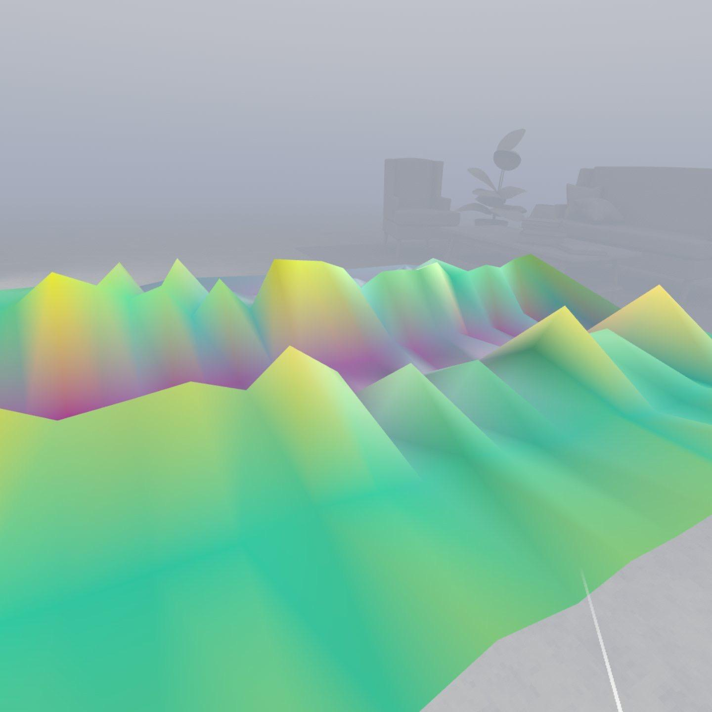

# oxam-vr-demo

## Running

- Sideload the `oxam-vr-demo.apk` file onto your Meta Quest 2, 3 or Pro headset.

## Datasets

Datasets are currently kept in the `Assets/Resources/Data` folder. Current datasets included are:

- `Data/AmazonOrderbook`, contains Amazon limit order book data from [LobsterData](https://lobsterdata.com/).
- `Data/AppleOrderbook`, contains Apple limit order book data
- `Data/RadcliffeTemperature`, contains the temperature of the Radcliffe Observatory the dates 1990-01-01 and 2023-12-31.
- `Data/RoyalMailSharePrice`, contains the share price of Royal Mail from [Yahoo Finance](https://uk.finance.yahoo.com/quote/ROYMY/history/?guccounter=1), between the dates 2022-01-01 and 2023-01-01.
- `Data/MusicGenrePCA`, contains music genre feature data from the [GTZAN](https://www.kaggle.com/datasets/andradaolteanu/gtzan-dataset-music-genre-classification/data) dataset reduced into 2D and 3D using PCA.
